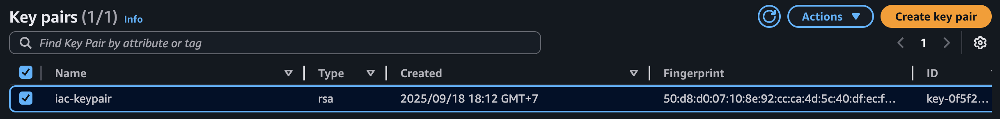

# Description
Guildline for deploying infrastructure to cloud environment using IaC tools

# Installation (in MacOS)
 ## Terraform
 1. Install via brew

    ```
    brew tap hashicorp/tap
    brew install hashicorp/tap/terraform
    ```

2. Check version
    ```
    terraform version
    ```

3. Export AWS Credentials

    ```
        export AWS_ACCESS_KEY_ID=<your-aws-access-key-id>
        export AWS_SECRET_ACCESS_KEY=<your-aws-secret-key>
        export AWS_REGION=<your-aws-region>
    ```

4. Build and push image to ECR
    ```
        cd services/lambda
        sh ecr.sh
    ```

5. Apply Terraform
    ```
        cd terraform
        terraform init
        terraform apply
    ```

6. Test Lambda Service
    ```
        aws lambda invoke --function-name lambda-demo --cli-binary-format raw-in-base64-out --payload file://input.json output.json
    ```

7. Destroy infa
    ```
        terraform destroy
    ```

## Ansible

1. Build and push docker image to ECR

    ```
    cd services
    sh ec2.sh
    ```

2. Create IAM role for EC2 (To login ECR and pull ECR image)
    

3. Create Security Group (For SSH)
    

4. Create and download key-pair file (.pem)
    

5. Run playbook
    ```
        cd ansible
        ansible-playbook playbooks/ec2_ecr.yml -e @vars.yml
    ```

6. Check result
    ```
        ssh -i <link-to-pem-file> ec2-user@<instance-public-ip>
        sudo docker images
    ```

    The final result will be like this 
     


# Next Step 
Integrate with Jenkins/Github Actions for CI/CD
    
